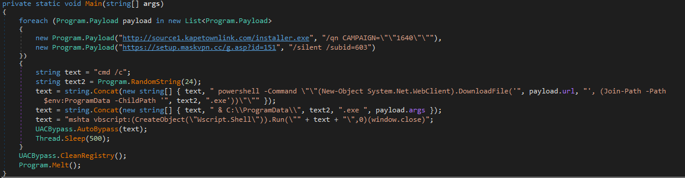

## Introduction

In this post, I highlight old UAC bypasss techniques that are still in use. Although the bypass techniques implements in the analyzed sample are older and known, attempts are still being made to exploit them. As a result, defenders should be made aware of these on-going threats. 

I ran across this simple .NET downloader I'm naming *Adan Downloader* based on it's project path. The malware implements UAC bypass techniques in order to execute a Powershell download command proxied through mshta.exe (https://attack.mitre.org/techniques/T1218/005/).

The UAC bypass techniques implemented are (https://attack.mitre.org/techniques/T1548/002/):
* UAC Bypass via Event Viewer
* UAC Bypass via Slui
* UAC Bypass via SilentCleanup Scheduled Task
* UAC Bypass via Fodhelper

### Analysis:

<table>
    <thead>
        <tr>
            <th colspan=2>Adan Downloader</th>
        </tr>
    </thead>
    <tbody>
        <tr>
            <td>Filename</td>
            <td>Stub.exe</td>
        </tr>
        <tr>
            <td>File Type</td>
            <td>.NET Binary</td>
        </tr>
        <tr>
            <td>MD5</td>
            <td>47E16AF98E41C83EB2F07A2D29CA8AF9</td>
        </tr>
        <tr>
            <td>SHA1</td>
            <td>4F5161BA956ECB4A453893EB3FC34C1313C6C701</td>
        </tr>
        <tr>
            <td>SHA256</td>
            <td>72C9919F885DD2A6F4491E5BC227224D6A68E09AF553AD6CB21617FE2BC56534</td>
        </tr>
        <tr>
            <td>PDB</td>
            <td>C:\Users\Thede\source\repos\Adan\Loader v1\obj\x64\Release\Stub.pdb</td>
        </tr>
        <tr>
            <td>VT</td>
            <td> 
                <a href="https://www.virustotal.com/gui/file/72c9919f885dd2a6f4491e5bc227224d6a68e09af553ad6cb21617fe2bc56534/relations)">72C9919F885DD2A6F4491E5BC227224D6A68E09AF553AD6CB21617FE2BC56534</a>
            </td>
        </tr>
    </tbody>
</table>

This downloader attempts to bypass User Account Control (UAC) to download unwanted files to a system. Upon execution, it performs the following:
 
* Creates a payload objects that contains the URLS and command line arguments for the downloaded file:
    ```
    hxxp://source1[.]kapetownlink[.]com/installer.exe - Args: /qn CAMPAIGN="1640"
    hxxps://setup[.]maskvpn[.]cc/g[.]asp?id=151 - Args: /silent /subid=603
    ```
    

